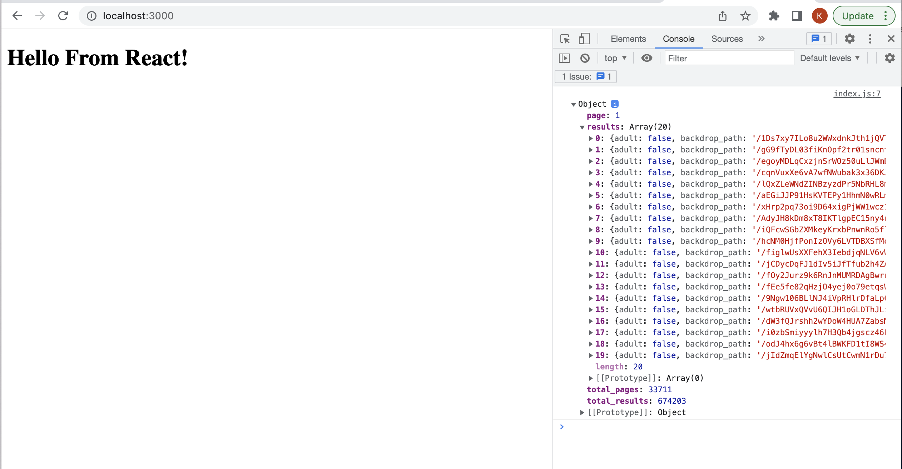
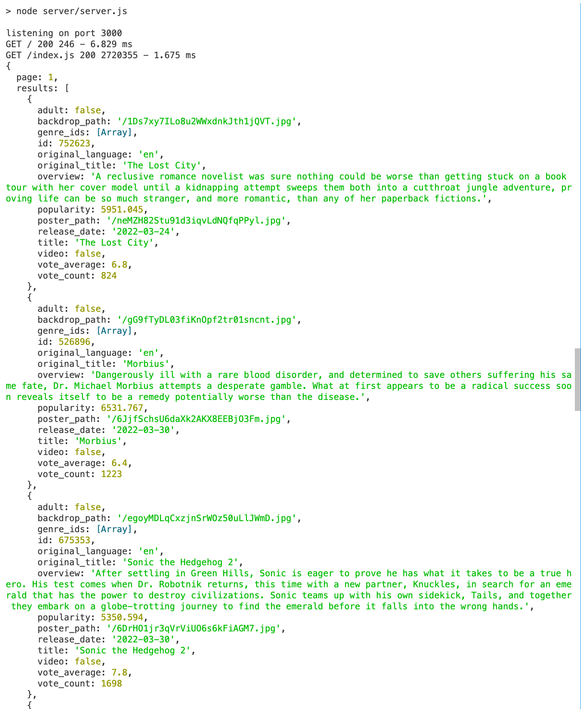

Please read [README.md](README.md) first

PROMPT: Create a basic react application using the TMDB api.

Requirements:

- Display a list of movies
- Dispay a separate list for the movies a user has liked: (it should start empty)
- For each movie a user should be able to select a movie and add it to their list
- A User should also be able to remove movies from their list

Extra Challenges:

- Stye with Material UI
- Think of new ways to display the content
- Allow the user to rename their list
- Allow the user to have more than one list
- Display multiple lists for a user to choose from

## Install Dependencies
```
npm install
```
If you do not have TMDB API Token go to the [README.md](README.md)

Create `.env` file in root directory of this project and add these two lines:
```env
TMDB_TOKEN=<your token>
PORT=3000
```

## Understand the File Structure and `package.json` file

1. In the `package.json` file look at the `scripts` field
2. ```json
       "scripts": {
               "test": "echo \"Error: no test specified\" && exit 1",
               "start": "node server/server.js",
               "nodemon": "nodemon server/server.js",
               "build": "webpack --config webpack.config.js",
               "watch": "webpack --watch --config webpack.config.js",
               "live": "npx webpack serve --live-reload --port 80 "
       }
   ```
3. These are scripts to be run in the terminal. For all scripts that are not `test` or `start` you need to run `npm run <cmd>`. For `test` and `start` simply run `npm test` or `npm start` in the terminal.

- `start`: runs the `server.js` file in the server directory
- `nodemon`: runs the server with nodemon. Read up on [nodemon](https://www.npmjs.com/package/nodemon)
- `build`: uses [webpack](https://webpack.js.org/guides/getting-started/) to buid from a single js file from a dir. In our case `src`
- `watch`: like the `build` cmd, except it rebuilds after any saved chages to the `src` directory
- `live`: creates a live [dev server](https://webpack.js.org/configuration/dev-server/#devserverlivereload) and opens your app in the browser. It can proxy your actual backend server if configured properly and allows for speedy development, but not necessary for this exercise. Compare the `devServer` field of [webpack.config.js](webpack.config.js) to [docs](https://webpack.js.org/configuration/dev-server/#devserverlivereload)

4. **NOTE** these scripts will not work until the app is propery configured.

## Set up server to serve public files in public folder

1. Create an `express` server in `server/server.js` file

```js
require("dotenv").config();
const { default: axios } = require("axios");
const express = require("express");
const morgan = require("morgan");
const path = require("path");

const STATIC_FILES = path.resolve(__dirname, "../public");
const TMDB_POPULAR_MOVIES_QUERY = `https://api.themoviedb.org/3/movie/popular?api_key=${process.env.TMDB_TOKEN}&language=en-US&page=1`;

const PORT = process.env.PORT || 3000;
const app = express();

app.use(morgan("tiny"));
app.use(express.static(STATIC_FILES));

app.use(express.json());
app.use(express.urlencoded({ extended: true }));

app.listen(PORT, () => {
  console.log("listening on port", PORT);
});

app.get("/api/movies/popular", async (req, res) => {
  const data = await (await axios.get(TMDB_POPULAR_MOVIES_QUERY)).data;
  console.log(data);
  res.status(200).send(data);
});
```
2. For docs on [express](https://expressjs.com/)
3. We are using this server serve our static files in `public` directory and to proxy our API calls from our front-end to TMDB API to aviod [CORS](https://developer.mozilla.org/en-US/docs/Web/HTTP/CORS).
4. We will use `morgan` for logging. See [docs](https://www.npmjs.com/package/morgan)
5. This example can get complex, but lets keep it simple and create only one `GET` request as this is a front-end exercise.
6. Once you have your `server/server.js` file saved you can run:
```bash
npm start
```
7. The Goal of this step is to serve static files. You should see `Hello World` when you navigate to http://localhost:3000. When complete use ```control + C``` to stop server.

## Create "Hello from React!" to make sure react and webpack are set up correctly

1. In the `src` directory we need to create our _entry_ file. This is the file the [webpack](webpack.config.js) file will look for to bundle our application into one `js` file in our `public` directory.
2. On line 5 of [webpack](webpack.config.js) we see

```js
        entry: './src/index.js',
```

3.  So we should create our `./src/index.js` file as that is then entry point of our [webpack](webpack.config.js) config file. Put this logic in `./src/index.js`

```js
import React from "react";
import ReactDOM from "react-dom";

ReactDOM.render(<h1>Hello From React!</h1>, document.getElementById("root"));
```

4. Start your server
```bash
npm start
```
5. Navigate to http://localhost:3000 and you should still see `Hello World`. Now uncomment out the `script` tag, likely on line 10 of `index.html`. We need the script to write to html on the `div` with id of `root`. Restart the server. (`control + c` to stop and `npm start` to run)
6. We still see `Hello World`. Which is to be expected. We need to build our `src/index.js` file from `webpack`. Run this cmd in a separate terminal.

```bash
npm run build
```
7. Restart express server (`control + c` to stop and `npm start` to run)
8. Go to your browser and you should see `Hello from React!`. If you succeed remove `Hello World` from `index.html` file in the `root` div.
9. If you suceeded. Great. No we can move on to the next section.

## Test api by making a simple front-end request to get movies and output to console in dev environment and also in browser dev tools
1. Update `src/index.js` to look like this.
```js
import axios from "axios";
import React, { useEffect } from "react";
import ReactDOM from "react-dom";

async function apiTest() {
  const data = await (await axios.get("/api/movies/popular")).data;
  console.log(data);
}

apiTest();

ReactDOM.render(<h1>Hello From React!</h1>, document.getElementById("root"));
```
2. Restart server and rebuild build webpack. It would be ideal if you still have two terminals open.

3. Go to http://localhost:3000
4. Check console output in server and in browser. You should get results.



5. Now you are ready to build your front-end. Good Luck!

## Use React to create the front-end and meet requirements
